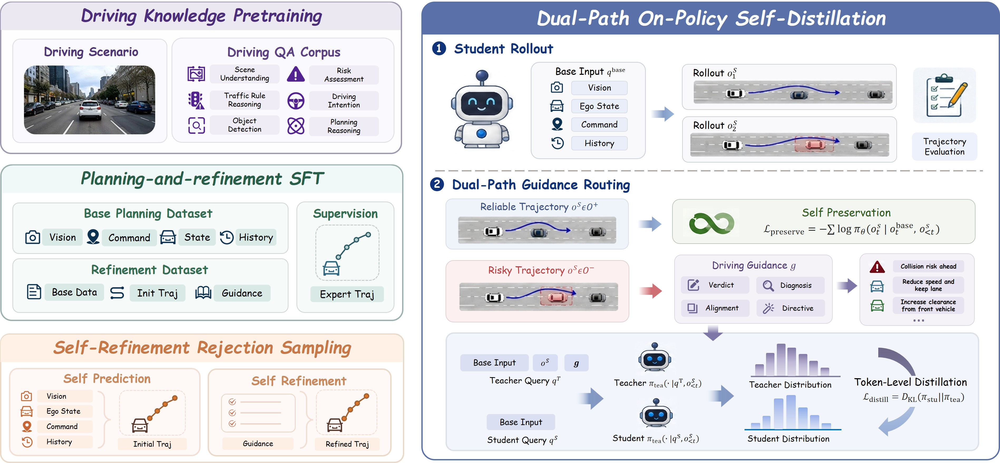
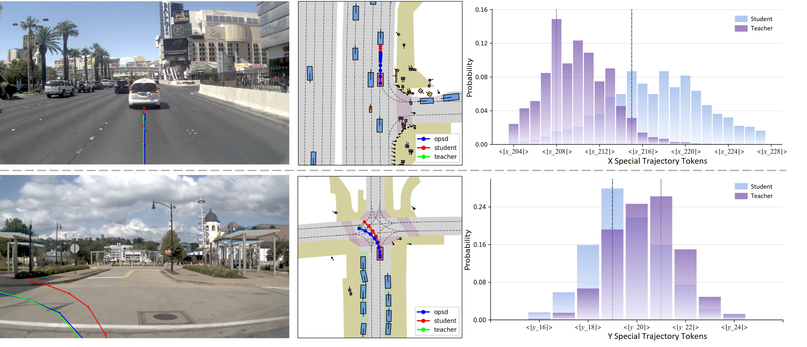

<div align="center">

<h1>Reflect-VLA: Internalizing Reflective Guidance via Dual-Path On-Policy Self-Distillation for Autonomous Driving</h1>

<p>Yuechen Luo<sup>1*</sup>, He Chong<sup>1*</sup>, Fang Li<sup>2*</sup>, Shaoqing Xu<sup>2*†</sup>, Hexin Zhang<sup>3</sup>, Ruiqi Zhang<sup>1</sup>, Ziying Song<sup>4</sup>, Lei Yang<sup>5</sup>, Zhi-Xin Yang<sup>2✉</sup>, Fuxi Wen<sup>1✉</sup></p>

<p><sup>1</sup> Tsinghua University · <sup>2</sup> University of Macau<br>
<sup>3</sup> University of Science and Technology of China<br>
<sup>4</sup> Beijing Jiaotong University · <sup>5</sup> Nanyang Technological University</p>

<p><sup>*</sup> Equal contribution · <sup>†, ✉</sup> Corresponding authors</p>

<p>
<a href=""></a>
<a href="https://luo-yc17.github.io/reflect-vla-web/"></a>
</p>
<p><em>Learning from reflection. Planning in a single pass.</em></p>

</div>

## ✨ Highlights

**The first application of OPSD to autonomous driving.** To our knowledge, Reflect-VLA is the first framework to introduce **On-Policy Self-Distillation (OPSD)** into autonomous-driving VLA planning. We propose **Dual-Path On-Policy Self-Distillation (Dual-OPSD)** to internalize reflective guidance: it distills token-level corrective distributions on risky student-generated trajectories while preserving reliable ones through self-imitation, enabling guidance-free, single-pass inference.

| Reflective Guidance | Dual-Path Distillation | Single-Pass Inference |
| :---: | :---: | :---: |
| Diagnose planning errors and provide actionable corrections | Correct risky trajectories while preserving reliable ones | Internalize reflective benefits in the student |

**Single-pass planning with internalized reflective guidance.** Reflect-VLA-4B reduces post-training time by over 90% compared with GRPO (33.4 h → 2.4 h per 10,000 samples).

| Model | NAVSIM v1 PDMS ↑ | NAVSIM v2 EPDMS ↑ | Bench2Drive DS ↑ |
| :--- | :---: | :---: | :---: |
| Reflect-VLA-0.8B | 89.3 | 88.8 | 76.03 |
| Reflect-VLA-2B | 90.0 | 89.5 | 77.39 |
| **Reflect-VLA-4B** | **91.5** | **91.2** | **80.15** |

See the [project page](https://luo-yc17.github.io/reflect-vla-web/) for benchmark comparisons and token-level analysis.

## 📖 Abstract

Reinforcement Learning (RL) substantially improves planning performance in autonomous-driving Vision-Language-Action (VLA) models. However, existing RL methods rely on scalar trajectory rewards that measure overall quality but fail to identify specific planning errors or provide actionable correction signals. In long-tail scenarios, errors in scene understanding, behavior selection, and trajectory execution are compressed into a single score. We observe that Reflective Guidance turns trajectory evaluation into explicit diagnoses and corrective instructions, substantially improving planning accuracy. Yet such guidance requires an initial prediction and its evaluation results, making it unavailable for direct single-pass inference. We propose **Reflect-VLA**, which treats Reflective Guidance as training-time privileged information and internalizes its planning benefits through **Dual-Path On-Policy Self-Distillation (Dual-OPSD)**. Unlike scalar-reward optimization, Dual-OPSD uses the driving score only to route student-generated trajectories. It distills dense token-level corrective distributions from the teacher for risky trajectories while applying self-imitation to preserve reliable ones. To provide reliable corrective distributions on student rollouts, the teacher is progressively constructed through Driving-Knowledge Pretraining, Planning-and-Refinement SFT, and Self-Refinement Rejection Sampling. At inference time, Reflect-VLA generates trajectories in a single pass without explicit guidance or iterative refinement. Experiments on NAVSIM v1/v2 and Bench2Drive demonstrate competitive planning performance while reducing training time by over 90% compared with RL.

## 🚀 Overview

<div align="center">
  
</div>

**Figure 3. Overview of Reflect-VLA.** Reflective Guidance is constructed from trajectory evaluation and used as privileged information to train a refinement-capable teacher. Dual-OPSD then transfers corrective distributions to the student on risky trajectories while preserving reliable student trajectories. Only the student is used for single-pass inference.

## 🖼️ Visualization

<div align="center">
  
</div>

**Figure 4. Qualitative comparisons and token-level analysis.** Left and middle: trajectories generated by the unguided student, guidance-conditioned teacher, and distilled student. Right: distributions over special trajectory tokens at critical decoding steps under the same student-generated prefix. Each token encodes a relative displacement quantized at 0.01 m resolution; e.g., `<|x_208|>` represents a 2.08 m forward displacement for the next waypoint.

## 📦 Release Checklist

- [ ] Reflect-VLA Inference Code
- [ ] Reflect-VLA Checkpoint
- [ ] Reflect-VLA Training Code
- [ ] Training Dataset

## 📚 Citation

```bibtex

```
